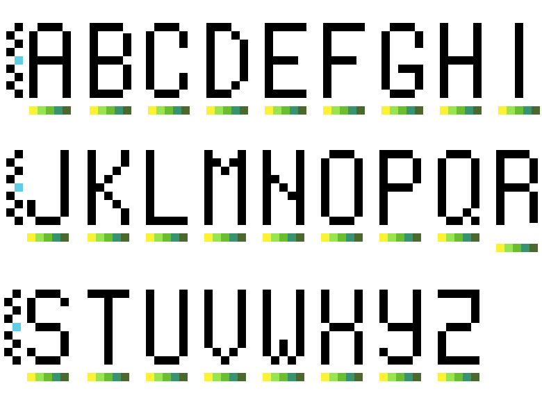

# 8-Bit Pixel Alphabet

This repository serves as a storage for my own 8-bit style pixel alphabet.

These pixel art letters are primarily used for designing logos for my various projects.

The pixel art has been created using [Pixelorama](https://github.com/Orama-Interactive/Pixelorama) (an open-source sprite editor).

## Available Presets

Currently, this repository contains the following presets:

- **Alphabet 11 x 5** (capital letters only)
  Each letter is a block with dimensions of 11 in height and 5 in width.
  Brush is 4px large.

- **Alphabet 9 x 5** (capital letters only)
  Each letter is a block with dimensions of 9 in height and 5 in width.
  Brush is 4 px large.

