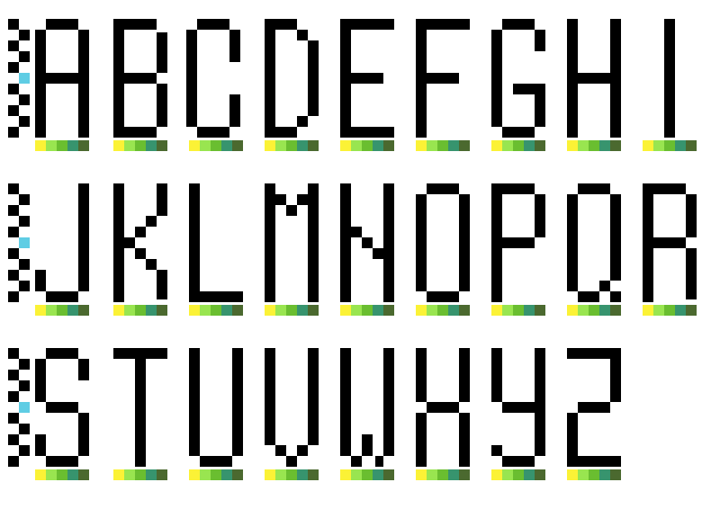

# 8-Bit Pixel Alphabet

This repository is a place where I store my own take on an 8-bit style pixel alphabet.

The primary purpose of these pixel art letters is to design logos for my various projects. 

The pixel art is created using [Pixelorama](https://github.com/Orama-Interactive/Pixelorama) (a robust open-source sprite editor).

## Available Presets

Currently, this repository contains the following presets:

- **Alphabet 11 x 5** (capital letters only)
  Each letter is a block with dimensions of 11px in height and 5px in width.

